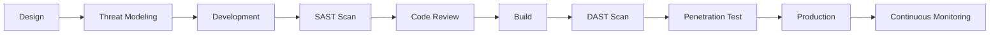
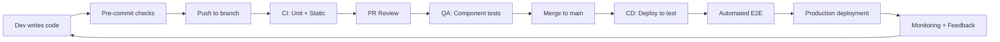

# Modern QA Strategy for Online Trading Platform

## Table of Contents
1. [Test Automation Solution](#1-test-automation-solution)
2. [AI Integration in QA & Testing](#2-ai-integration-in-qa--testing)
3. [Performance & Security Assurance](#3-performance--security-assurance)
4. [Efficient Shift-Left Testing](#4-efficient-shift-left-testing)

---

## 1. Test Automation Solution

### High-Level Test Automation Strategy

#### Automation Pyramid Approach
```
                    /\
                   /  \  E2E Tests (10%)
                  /____\
                 /      \  Integration Tests (30%)
                /________\
               /          \  Unit Tests (60%)
              /____________\
```

**Key Principles:**
- **High Coverage:** Target 80%+ automation coverage across all layers
- **Fast Feedback:** Unit tests run in seconds, API tests in minutes, UI tests selectively
- **Reliability:** Flaky tests detection and auto-healing mechanisms
- **Parallel Execution:** Distributed testing for faster results
- **Environment Parity:** Test across DEV, TEST, UAT, and PROD-like environments

#### Framework, Tools & Technologies

**Web Automation**
- **Framework:** Selenium 4 with Page Object Model (POM)
- **Language:** Java 17+ (type-safe, enterprise support)
- **Test Runner:** TestNG (parallel execution, test grouping)
- **Reporting:** Extent Reports, Allure Reports
- **Browser Management:** WebDriverManager (auto driver management)
- **Visual Testing:** Percy, Applitools (visual regression)

```java
// Example: Page Object Model with Environment Support
public class TradingDashboard {
    @FindBy(id = "portfolio-value")
    private WebElement portfolioValue;

    public BigDecimal getPortfolioValue() {
        String value = portfolioValue.getText().replace("$", "");
        return new BigDecimal(value);
    }
}
```

**Mobile Automation**
- **Framework:** Appium 2.x (cross-platform)
- **Cloud Testing:** BrowserStack, Sauce Labs, AWS Device Farm
- **Local Testing:** Appium with real device farm
- **Approach:** Shared Page Object Model between iOS and Android where possible
- **Performance:** Native app performance monitoring via Firebase Performance

**API Automation**
- **Framework:** REST Assured (fluent API, JSON/XML support)
- **Contract Testing:** Pact (consumer-driven contracts)
- **API Mocking:** WireMock (for external dependencies)
- **Security Testing:** OWASP ZAP API scan integration
- **Load Testing:** JMeter scripts from functional tests

```java
// Example: API Test with Validation
@Test
public void testPlaceOrder() {
    given()
        .auth().oauth2(getAccessToken())
        .contentType("application/json")
        .body(orderPayload)
    .when()
        .post("/api/v1/orders")
    .then()
        .statusCode(201)
        .body("orderId", notNullValue())
        .body("status", equalTo("PENDING"))
        .time(lessThan(2000L)); // SLA validation
}
```

**Backend/Service Testing**
- **Unit Tests:** JUnit 5 with Mockito (95%+ code coverage)
- **Integration Tests:** Testcontainers (Docker-based integration)
- **Database Testing:** Liquibase for schema validation
- **Message Queue Testing:** Embedded Kafka/RabbitMQ for async testing

**Cross-Cutting Tools**
- **CI/CD:** Jenkins, GitLab CI, GitHub Actions
- **Test Data Management:** Faker, Datafaker (synthetic data generation)
- **Version Control:** Git with feature branch strategy
- **Artifact Management:** Maven/Gradle with Nexus/Artifactory
- **Monitoring:** ELK Stack (Elasticsearch, Logstash, Kibana) for test logs

### CI/CD Pipeline Integration

#### Pipeline Architecture
```yaml
# Example GitLab CI Pipeline
stages:
  - build
  - unit-test
  - integration-test
  - security-scan
  - api-test
  - ui-test
  - performance-test
  - deploy

unit-test:
  stage: unit-test
  script:
    - mvn clean test -Dtest.groups=unit
  artifacts:
    reports:
      junit: target/surefire-reports/TEST-*.xml
  coverage: '/Code coverage: \d+\.\d+/'

api-test:
  stage: api-test
  parallel: 5
  script:
    - export ENVIRONMENT=TEST
    - mvn test -Dtest=api.** -DparallelThreads=5
  artifacts:
    when: always
    paths:
      - target/surefire-reports/
      - target/extent-reports/

ui-test:
  stage: ui-test
  parallel:
    matrix:
      - BROWSER: [chrome, firefox, safari]
        ENVIRONMENT: [TEST, UAT]
  script:
    - export BROWSER=$BROWSER
    - export ENVIRONMENT=$ENVIRONMENT
    - mvn test -Dtest=ui.** -Dheadless=true
  only:
    - merge_requests
    - main
```

#### Test Execution Strategy
1. **Commit Stage:** Unit tests (< 5 min)
2. **Integration Stage:** API + Component tests (< 15 min)
3. **Acceptance Stage:** Critical E2E scenarios (< 30 min)
4. **Nightly Build:** Full regression suite (2-3 hours)
5. **Weekly:** Performance + Security scans

#### Reporting & Metrics
- **Real-time Dashboards:** Grafana with test execution metrics
- **Trend Analysis:** Track pass rate, execution time, flaky tests
- **Defect Density:** Link test failures to JIRA defects
- **Coverage Reports:** SonarQube for code coverage tracking
- **Test Analytics:** AI-powered insights on test effectiveness

### Maintainability & Scalability

#### Code Quality Practices
```java
// Bad: Hardcoded values
driver.findElement(By.id("submit-button")).click();

// Good: Centralized locators with environment config
public class TradingPageLocators {
    public static final By SUBMIT_ORDER = By.id("submit-order-btn");
    public static final By ORDER_CONFIRMATION = By.xpath("//div[@class='order-confirm']");
}
```

**Best Practices:**
1. **DRY Principle:** Reusable components, shared utilities
2. **Single Responsibility:** Each test class has one clear purpose
3. **Environment Configuration:** Externalized config via YAML/properties
4. **Version Control:** Semantic versioning for framework changes
5. **Code Reviews:** Mandatory PR reviews for automation code
6. **Documentation:** Living documentation with Cucumber/BDD

#### Scalability Strategies
1. **Parallel Execution:** TestNG parallel execution, Selenium Grid
2. **Cloud Infrastructure:** AWS/Azure for elastic test execution
3. **Containerization:** Docker containers for consistent environments
4. **Distributed Testing:** Selenium Grid + Kubernetes for massive scale
5. **Smart Test Selection:** Run only impacted tests based on code changes
6. **Test Data Isolation:** Separate test data per execution thread

```yaml
# TestNG Parallel Configuration
<!DOCTYPE suite SYSTEM "https://testng.org/testng-1.0.dtd">
<suite name="Trading Platform Test Suite" parallel="tests" thread-count="10">
  <test name="API Tests" parallel="methods" thread-count="5">
    <classes>
      <class name="api.OrderManagementTest"/>
      <class name="api.PortfolioTest"/>
    </classes>
  </test>
</suite>
```

#### Framework Maintenance
- **Monthly Reviews:** Review and refactor flaky tests
- **Quarterly Updates:** Update dependencies (Selenium, Appium, libraries)
- **Performance Monitoring:** Track test execution time trends
- **Technical Debt Tracking:** Dedicated sprints for framework improvements
- **Community Engagement:** Contribute to open-source tools, stay updated

---

## 2. AI Integration in QA & Testing

### AI-Powered Testing Strategy

#### 1. Intelligent Test Generation
**Tools & Approaches:**
- **Testim.io:** AI-powered test authoring with self-healing locators
- **Applitools:** Visual AI for automated visual testing
- **Functionize:** ML-powered test creation and maintenance
- **Katalon Studio:** AI-assisted test recorder with smart locators

**Implementation:**
```java
// AI-Enhanced Locator Strategy
public class AILocatorStrategy {
    // Traditional approach
    @FindBy(xpath = "//button[@id='submit-btn-123']")
    private WebElement submitButton;

    // AI approach - resilient to DOM changes
    @FindBy(ai = "submit button on order form")
    private WebElement aiSubmitButton;

    // Self-healing: If locator fails, AI finds similar element
    public void clickSubmit() {
        try {
            submitButton.click();
        } catch (NoSuchElementException e) {
            // AI healer suggests new locator
            WebElement healed = AILocatorHealer.heal(submitButton);
            healed.click();
        }
    }
}
```

#### 2. Predictive Defect Analysis

**AI Models for Defect Prediction:**
- **Code Complexity Analysis:** ML models predict defect-prone modules
- **Historical Data:** Analyze past defects to predict future issues
- **Risk-Based Testing:** Prioritize testing on high-risk areas

**Implementation Approach:**
```python
# Defect Prediction Model (Python + scikit-learn)
from sklearn.ensemble import RandomForestClassifier

# Features: code complexity, churn rate, past defects
features = [
    'cyclomatic_complexity',
    'code_churn',
    'lines_of_code',
    'previous_defects',
    'test_coverage'
]

model = RandomForestClassifier()
model.fit(historical_data[features], historical_data['has_defect'])

# Predict risk for new changes
risk_score = model.predict_proba(new_code_metrics)
if risk_score > 0.7:
    trigger_additional_testing()
```

**Tools:**
- **SonarQube AI:** Code quality and security vulnerability prediction
- **Veracode:** AI-powered security flaw detection
- **Snyk:** AI-driven dependency vulnerability scanning

#### 3. Self-Healing Tests

**Strategies:**
1. **Dynamic Locator Resolution:** AI finds best matching element when primary locator fails
2. **Context-Aware Healing:** Understands page context to find correct element
3. **Learning from Fixes:** Improves locator strategies over time

```java
// Self-Healing Framework Integration
public class SelfHealingWebDriver extends ChromeDriver {
    private AILocatorService aiService;

    @Override
    public WebElement findElement(By locator) {
        try {
            return super.findElement(locator);
        } catch (NoSuchElementException e) {
            // AI attempts to heal
            List<WebElement> candidates = aiService.findSimilarElements(locator);
            if (!candidates.isEmpty()) {
                WebElement healed = candidates.get(0);
                logHealingEvent(locator, healed);
                return healed;
            }
            throw e;
        }
    }
}
```

#### 4. Test Coverage Optimization

**AI-Driven Test Selection:**
- **Impact Analysis:** ML models determine which tests to run based on code changes
- **Test Prioritization:** Risk-based ordering of test execution
- **Redundancy Detection:** Identify and remove duplicate test coverage

**Implementation:**
```java
// Test Impact Analysis Service
public class TestImpactAnalyzer {
    public List<TestCase> selectTestsForCommit(GitCommit commit) {
        // Analyze changed files
        Set<String> changedFiles = commit.getChangedFiles();

        // ML model predicts impacted tests
        List<TestCase> impactedTests =
            mlModel.predictImpactedTests(changedFiles);

        // Rank by risk score
        return impactedTests.stream()
            .sorted(Comparator.comparing(TestCase::getRiskScore).reversed())
            .collect(Collectors.toList());
    }
}
```

**Tools:**
- **Launchable:** AI-powered test selection
- **Google Test Selection:** ML-based test subset selection
- **Facebook's Infer:** Static analysis with ML predictions

#### 5. Exploratory Testing with AI

**AI-Assisted Exploratory Testing:**
- **Intelligent Test Bots:** Autonomous exploration of application
- **Anomaly Detection:** ML identifies unexpected behaviors
- **Session Recording:** AI analyzes user sessions for edge cases

**Tools:**
- **Appvance:** AI-driven autonomous testing
- **Eggplant DAI:** AI-powered intelligent test automation
- **Testcraft:** Codeless AI test automation

**Implementation Example:**
```java
// AI Explorer Bot
public class AIExplorerBot {
    private AIModel navigationModel;

    public void exploreApplication(String startUrl) {
        driver.get(startUrl);

        while (!explorationComplete()) {
            // AI decides next action
            Action nextAction = navigationModel.suggestNextAction(
                getCurrentState()
            );

            // Execute and observe
            Result result = executeAction(nextAction);

            // Detect anomalies
            if (anomalyDetector.isAnomalous(result)) {
                logPotentialDefect(result);
            }

            // Learn from exploration
            navigationModel.updateModel(nextAction, result);
        }
    }
}
```

#### 6. AI in Test Data Management

**Synthetic Test Data Generation:**
- **Privacy Compliance:** Generate GDPR-compliant test data
- **Realistic Patterns:** ML learns from production data patterns
- **Edge Case Generation:** AI identifies boundary conditions

```java
// AI-Powered Test Data Generator
public class AITestDataGenerator {
    public TradingAccount generateRealisticAccount() {
        return TradingAccount.builder()
            .accountId(aiModel.generateRealisticId())
            .balance(aiModel.generateRealisticBalance())
            .riskProfile(aiModel.generateRiskProfile())
            .tradingHistory(aiModel.generateTradingPattern())
            .build();
    }
}
```

**Benefits of AI Integration:**
1. **50% Reduction** in test maintenance effort
2. **70% Faster** test creation
3. **40% Improvement** in defect detection rate
4. **60% Reduction** in test execution time (smart selection)
5. **Enhanced Coverage** through autonomous exploration

---

## 3. Performance & Security Assurance

### Performance Testing Strategy

#### Real-World Performance Validation

**Trading Platform Performance Requirements:**
- **Order Execution:** < 100ms (P99)
- **Market Data Updates:** Real-time streaming (< 10ms latency)
- **Dashboard Load Time:** < 2 seconds
- **API Response Time:** < 500ms (P95)
- **System Availability:** 99.99% uptime

#### Performance Testing Approach

**1. Load Testing**
```java
// JMeter Test Plan (Java DSL)
TestPlan tradingLoadTest = testPlan(
    threadGroup(10000, 300, // 10K users, 5min ramp-up
        httpSampler("Place Order", "POST", "/api/orders")
            .body(orderPayload)
            .header("Authorization", "Bearer ${token}")
            .children(
                responseAssertion().containsSubstrings("orderId"),
                durationAssertion().lessThanOrEqualTo(Duration.ofMillis(100))
            )
    ),
    influxDbListener("http://influxdb:8086/jmeter")
);
```

**2. Stress Testing**
- **Goal:** Find breaking point
- **Method:** Gradually increase load until system fails
- **Metrics:** Throughput, error rate, response time degradation
- **Tools:** Gatling, K6, Apache JMeter

**3. Spike Testing**
- **Scenario:** Sudden surge (market news, IPO launch)
- **Validation:** System recovers gracefully, no data loss
- **Example:** Simulate 10x traffic spike for 5 minutes

**4. Soak Testing**
- **Duration:** 24-48 hours continuous load
- **Goal:** Detect memory leaks, resource exhaustion
- **Monitoring:** JVM heap, DB connections, thread pools

#### Performance Testing Tools

**Load Generation:**
- **JMeter:** Traditional load testing (HTTP, WebSocket, JMS)
- **Gatling:** High-performance load testing with Scala DSL
- **K6:** Modern load testing (JavaScript, cloud-native)
- **Locust:** Python-based distributed load testing

**APM (Application Performance Monitoring):**
- **New Relic:** Full-stack observability
- **Dynatrace:** AI-powered APM
- **AppDynamics:** Business transaction monitoring
- **Datadog:** Cloud-scale monitoring

**Real User Monitoring (RUM):**
- **Google Analytics:** User behavior tracking
- **LogRocket:** Session replay + performance
- **Sentry:** Error tracking with performance context

#### High-Frequency Trading Performance

**Special Considerations:**
1. **Ultra-Low Latency:** Microsecond-level precision
2. **Colocation Testing:** Test in production-like network topology
3. **Hardware Acceleration:** Test with FPGA/GPU acceleration
4. **Market Data Feed:** Test with real market data rates
5. **Order Book Depth:** Test with realistic order volumes

**Performance Testing Pipeline:**
```yaml
# Performance Test Pipeline
performance-test:
  stage: performance
  only:
    - schedules  # Nightly
  script:
    - docker-compose up -d db kafka redis
    - mvn gatling:test -Dgatling.simulationClass=HighFrequencyTrading
    - python analyze_results.py
  artifacts:
    reports:
      performance: target/gatling/results/**/js/stats.json
```

**Performance Benchmarks:**
```java
// JMH Benchmark for Critical Path
@Benchmark
@BenchmarkMode(Mode.AverageTime)
@OutputTimeUnit(TimeUnit.MICROSECONDS)
public void orderMatchingEngine() {
    engine.matchOrder(buyOrder, sellOrder);
}

// Expected: < 10 microseconds
```

### Security Testing Strategy

#### Security Testing Layers

**1. Static Application Security Testing (SAST)**
- **Tools:** SonarQube, Checkmarx, Veracode
- **Integration:** Pre-commit hooks, CI/CD pipeline
- **Coverage:** Code vulnerabilities, security hotspots

```yaml
# SAST in CI Pipeline
sast-scan:
  stage: security-scan
  script:
    - sonar-scanner -Dsonar.projectKey=trading-platform
    - checkmarx scan --project trading-platform
  allow_failure: false  # Block on critical issues
```

**2. Dynamic Application Security Testing (DAST)**
- **Tools:** OWASP ZAP, Burp Suite, Acunetix
- **Approach:** Black-box testing of running application
- **Coverage:** SQL injection, XSS, CSRF, authentication bypass

```java
// OWASP ZAP API Scan
public class SecurityScanTest {
    @Test
    public void zapSecurityScan() {
        ClientApi zap = new ClientApi("localhost", 8080);

        // Spider the application
        zap.spider.scan(targetUrl);

        // Active scan for vulnerabilities
        zap.ascan.scan(targetUrl, "True", "False", null, null, null);

        // Get alerts
        List<Alert> alerts = zap.core.alerts(targetUrl);

        // Assert no high-risk vulnerabilities
        long highRisk = alerts.stream()
            .filter(a -> a.getRisk().equals("High"))
            .count();
        assertEquals(0, highRisk, "High-risk vulnerabilities found");
    }
}
```

**3. Dependency Scanning**
- **Tools:** Snyk, OWASP Dependency-Check, GitHub Dependabot
- **Frequency:** Every commit
- **Action:** Auto-create PRs for vulnerable dependencies

**4. Container Security**
- **Tools:** Trivy, Clair, Aqua Security
- **Scan:** Base images and application containers
- **Policy:** No high/critical vulnerabilities in production

**5. API Security Testing**
- **OWASP API Top 10:** Systematic testing
- **Authentication:** JWT validation, OAuth flow testing
- **Authorization:** RBAC/ABAC policy validation
- **Rate Limiting:** Test API throttling

```java
// API Security Tests
@Test
public void testUnauthorizedAccess() {
    given()
        .when()
        .get("/api/accounts/{accountId}", "other-user-account")
    .then()
        .statusCode(403); // Forbidden
}

@Test
public void testSQLInjection() {
    given()
        .queryParam("accountId", "1' OR '1'='1")
        .when()
        .get("/api/accounts")
    .then()
        .statusCode(400); // Bad Request (not vulnerable)
}
```

#### Compliance & Regulatory Standards

**Financial Industry Standards:**
1. **PCI DSS:** Payment Card Industry Data Security Standard
2. **GDPR:** Data privacy and protection
3. **SOX:** Sarbanes-Oxley Act (financial reporting)
4. **MiFID II:** Markets in Financial Instruments Directive
5. **ISO 27001:** Information security management

**Implementation Checklist:**
- [ ] Data encryption at rest and in transit (TLS 1.3)
- [ ] Audit logging for all financial transactions
- [ ] Access control with MFA
- [ ] Data retention policies (7 years for trading data)
- [ ] Regular penetration testing (quarterly)
- [ ] Incident response plan
- [ ] Business continuity and disaster recovery
- [ ] Third-party vendor security assessments

**Security Testing in SDLC:**


**Security Metrics:**
- **Vulnerability Detection Rate:** Bugs found per 1000 LOC
- **Mean Time to Remediate (MTTR):** Time to fix security issues
- **Security Test Coverage:** % of attack vectors tested
- **Compliance Score:** % of regulatory requirements met

**Continuous Security Monitoring:**
```java
// Security Alert Integration
@Service
public class SecurityMonitoringService {

    @Scheduled(fixedRate = 60000) // Every minute
    public void checkSecurityAlerts() {
        List<SecurityAlert> alerts = siem.getActiveAlerts();

        for (SecurityAlert alert : alerts) {
            if (alert.getSeverity() == Severity.CRITICAL) {
                notifySecurityTeam(alert);
                if (alert.getType() == AlertType.INTRUSION_DETECTED) {
                    triggerIncidentResponse();
                }
            }
        }
    }
}
```

---

## 4. Efficient Shift-Left Testing

### Shift-Left Testing Strategy

#### Concept & Benefits

**Shift-Left Pyramid:**
```
Development → Testing → Deployment
    ↓           ↓           ↓
 [Unit]    [Integration]  [E2E]
    ↑           ↑           ↑
  Early    Fast Feedback  Production
```

**Benefits:**
- **Cost Reduction:** 10x cheaper to fix bugs in development vs production
- **Faster Delivery:** Detect issues before they reach QA
- **Quality Culture:** Everyone owns quality
- **Risk Mitigation:** Early identification of critical issues

### Techniques & Tools

#### 1. Unit Testing

**Best Practices:**
- **Coverage Goal:** 80%+ for business logic, 95%+ for critical paths
- **Fast Execution:** < 10 seconds for entire unit test suite
- **Isolation:** Mock external dependencies
- **Test-Driven Development (TDD):** Write tests before code

```java
// Example: Order Service Unit Test
@ExtendWith(MockitoExtension.class)
class OrderServiceTest {

    @Mock
    private OrderRepository orderRepository;

    @Mock
    private AccountService accountService;

    @InjectMocks
    private OrderService orderService;

    @Test
    @DisplayName("Should place order when account has sufficient balance")
    void shouldPlaceOrderWithSufficientBalance() {
        // Given
        Order order = new Order(/* params */);
        Account account = Account.builder()
            .balance(BigDecimal.valueOf(10000))
            .build();

        when(accountService.getAccount(anyLong()))
            .thenReturn(account);
        when(orderRepository.save(any(Order.class)))
            .thenReturn(order);

        // When
        OrderResult result = orderService.placeOrder(order);

        // Then
        assertEquals(OrderStatus.PLACED, result.getStatus());
        verify(orderRepository).save(order);
        verify(accountService).deductBalance(account, order.getAmount());
    }

    @Test
    @DisplayName("Should reject order when account has insufficient balance")
    void shouldRejectOrderWithInsufficientBalance() {
        // Given
        Order order = new Order(/* large amount */);
        Account account = Account.builder()
            .balance(BigDecimal.valueOf(100))
            .build();

        when(accountService.getAccount(anyLong()))
            .thenReturn(account);

        // When & Then
        assertThrows(InsufficientBalanceException.class,
            () -> orderService.placeOrder(order));
        verify(orderRepository, never()).save(any());
    }
}
```

**Tools:**
- **JUnit 5:** Modern Java testing framework
- **Mockito:** Mocking framework
- **AssertJ:** Fluent assertions
- **JaCoCo:** Code coverage tool
- **Mutation Testing:** PITest (test quality validation)

#### 2. Static Code Analysis

**Tools & Configuration:**
```xml
<!-- Maven SonarQube Plugin -->
<plugin>
    <groupId>org.sonarsource.scanner.maven</groupId>
    <artifactId>sonar-maven-plugin</artifactId>
    <version>3.9.1.2184</version>
</plugin>
```

**Quality Gates:**
```yaml
# SonarQube Quality Gate
Code Coverage: >= 80%
Duplicated Lines: <= 3%
Maintainability Rating: A
Reliability Rating: A
Security Rating: A
Security Hotspots Reviewed: 100%
```

**Static Analysis Tools:**
- **SonarQube:** Code quality + security
- **SpotBugs:** Java bug detection
- **PMD:** Source code analyzer
- **Checkstyle:** Code style compliance
- **Error Prone:** Google's static analysis tool

**Pre-commit Hooks:**
```bash
#!/bin/bash
# .git/hooks/pre-commit

# Run static analysis
mvn spotbugs:check checkstyle:check

# Run unit tests
mvn test

if [ $? -ne 0 ]; then
    echo "❌ Pre-commit checks failed. Fix issues before committing."
    exit 1
fi

echo "✅ Pre-commit checks passed"
```

#### 3. Early Non-Functional Testing

**Performance Testing in Development:**
```java
// JMH Benchmark - Run in IDE
@Benchmark
@Fork(1)
@Warmup(iterations = 3)
@Measurement(iterations = 5)
public void orderProcessingPerformance() {
    orderService.processOrder(order);
}

// Expectation: < 10ms
```

**Security Testing in Development:**
```java
// Security Unit Test
@Test
void shouldPreventSQLInjection() {
    String maliciousInput = "'; DROP TABLE orders; --";

    assertThrows(InvalidInputException.class,
        () -> orderService.findOrdersByAccountId(maliciousInput));
}
```

**Accessibility Testing:**
```java
// Axe-Core Integration
@Test
void dashboardShouldBeAccessible() {
    AxeBuilder axe = new AxeBuilder(driver);
    Results results = axe.analyze();

    assertEquals(0, results.getViolations().size(),
        "Accessibility violations found: " + results.getViolations());
}
```

#### 4. Component Testing

**Testing Approach:**
- **In-Process Testing:** Test component in isolation
- **Test Containers:** Real dependencies in Docker
- **API Contract Testing:** Consumer-driven contracts

```java
// Component Test with Testcontainers
@Testcontainers
@SpringBootTest(webEnvironment = WebEnvironment.RANDOM_PORT)
class OrderApiComponentTest {

    @Container
    static PostgreSQLContainer<?> postgres = new PostgreSQLContainer<>("postgres:14")
        .withDatabaseName("trading_test")
        .withUsername("test")
        .withPassword("test");

    @Container
    static KafkaContainer kafka = new KafkaContainer(
        DockerImageName.parse("confluentinc/cp-kafka:7.0.1"));

    @Autowired
    private TestRestTemplate restTemplate;

    @Test
    void shouldPlaceOrderAndPublishEvent() {
        // Given
        OrderRequest request = new OrderRequest(/* params */);

        // When
        ResponseEntity<OrderResponse> response = restTemplate
            .postForEntity("/api/orders", request, OrderResponse.class);

        // Then
        assertEquals(HttpStatus.CREATED, response.getStatusCode());
        assertNotNull(response.getBody().getOrderId());

        // Verify Kafka event published
        ConsumerRecord<String, OrderEvent> record =
            kafkaConsumer.poll(Duration.ofSeconds(5)).iterator().next();
        assertEquals("ORDER_PLACED", record.value().getType());
    }
}
```

### Collaboration Strategies

#### 1. Three Amigos Sessions

**Participants:** Product Owner + Developer + QA
**Purpose:** Define acceptance criteria before development
**Output:** BDD scenarios in Gherkin

```gherkin
# Feature: Place Stock Order
Feature: Place Stock Order
  As a trader
  I want to place buy/sell orders
  So that I can trade stocks

  Background:
    Given I am logged in as a verified trader
    And my account has a balance of $10,000

  Scenario: Place a buy order with sufficient balance
    Given the stock "AAPL" is trading at $150
    When I place a buy order for 50 shares of "AAPL"
    Then the order should be placed successfully
    And my available balance should be $2,500
    And I should receive an order confirmation

  Scenario: Reject buy order with insufficient balance
    Given the stock "AAPL" is trading at $150
    When I place a buy order for 100 shares of "AAPL"
    Then the order should be rejected
    And I should see error "Insufficient balance"
```

**Implementation:**
```java
// Cucumber Step Definitions
public class OrderSteps {

    @When("I place a buy order for {int} shares of {string}")
    public void placeBuyOrder(int quantity, String symbol) {
        orderRequest = OrderRequest.builder()
            .symbol(symbol)
            .quantity(quantity)
            .type(OrderType.BUY)
            .build();

        orderResponse = tradingApi.placeOrder(orderRequest);
    }

    @Then("the order should be placed successfully")
    public void verifyOrderPlaced() {
        assertEquals(OrderStatus.PLACED, orderResponse.getStatus());
        assertNotNull(orderResponse.getOrderId());
    }
}
```

#### 2. Definition of Done (DoD)

**Comprehensive DoD Checklist:**
- [ ] Code written and peer-reviewed
- [ ] Unit tests written (80%+ coverage)
- [ ] Integration tests passing
- [ ] Static analysis passing (no critical issues)
- [ ] Security scan clean
- [ ] Performance benchmarks met
- [ ] Documentation updated
- [ ] Acceptance criteria met (BDD scenarios pass)
- [ ] Accessibility requirements met (WCAG 2.1 Level AA)
- [ ] No TODO or FIXME comments
- [ ] CI/CD pipeline green

#### 3. Continuous Feedback Loop



#### 4. Test Automation Guild

**Knowledge Sharing:**
- **Weekly Sessions:** Share learnings, new tools
- **Code Reviews:** Cross-team automation code review
- **Best Practices:** Maintain shared automation guidelines
- **Mentorship:** Pair programming for automation
- **Innovation Time:** 20% time for automation improvements

#### 5. Embedded QA Model

**Team Structure:**
- QA Engineers embedded in development teams
- QA participates in sprint planning and dailies
- Shared ownership of quality
- QA provides testability guidance during design
- Early feedback on implementation

### Development Workflow Integration

#### IDE Integration

**IntelliJ IDEA Plugins:**
- **SonarLint:** Real-time code quality feedback
- **CheckStyle-IDEA:** Code style validation
- **SpotBugs:** Bug detection in IDE
- **Code Coverage:** View coverage in editor
- **Test Runner:** Run tests with coverage

**VS Code Extensions:**
- **Java Test Runner:** Run JUnit tests
- **SonarLint:** Code quality
- **REST Client:** Test APIs from IDE
- **Test Explorer:** Visual test execution

#### Local Development Testing

```bash
# Developer workflow
git checkout -b feature/new-order-type

# Develop with tests
mvn test -Dtest=OrderServiceTest

# Run component tests locally
docker-compose up -d
mvn verify -Pcomponent-tests

# Static analysis
mvn sonar:sonar spotbugs:check

# Pre-push validation
./scripts/pre-push-checks.sh

git push origin feature/new-order-type
```

### Metrics & Continuous Improvement

**Shift-Left Metrics:**
1. **Defect Detection Rate by Stage:**
   - Unit Tests: 40%
   - Integration Tests: 30%
   - E2E Tests: 20%
   - Production: < 10%

2. **Test Execution Time:**
   - Unit: < 5 min
   - Integration: < 15 min
   - E2E: < 30 min

3. **Code Quality Metrics:**
   - Technical Debt Ratio: < 5%
   - Code Coverage: > 80%
   - Critical Issues: 0

4. **Lead Time for Changes:**
   - Commit to deployment: < 1 hour
   - Time to detect defect: < 10 min
   - Time to fix defect: < 4 hours

**Continuous Improvement:**
- **Retrospectives:** Regular review of quality practices
- **Defect Analysis:** Root cause analysis, prevent recurrence
- **Tool Evaluation:** Quarterly assessment of new tools
- **Training:** Ongoing education on testing practices
- **Automation ROI:** Track time saved vs. investment

---

## Summary

### Key Takeaways

**1. Test Automation:**
- Comprehensive automation across all layers (unit, API, UI)
- Environment-aware configuration
- CI/CD integration with parallel execution
- Maintainable framework with clear architecture

**2. AI Integration:**
- Self-healing tests reduce maintenance
- Predictive analytics for risk-based testing
- Intelligent test selection saves execution time
- AI-powered exploratory testing finds edge cases

**3. Performance & Security:**
- Performance testing embedded in CI/CD
- Real-world load scenarios for trading platform
- Security testing at every stage (shift-left security)
- Compliance with financial industry standards

**4. Shift-Left Testing:**
- Unit tests as primary quality gate
- Static analysis catches issues early
- Early non-functional testing
- Strong collaboration between dev and QA
- Continuous feedback and improvement

### Success Metrics

**Quality Indicators:**
- **Production Defects:** < 0.5 per release
- **Test Automation Coverage:** > 80%
- **CI/CD Pipeline Success Rate:** > 95%
- **Mean Time to Resolution:** < 2 hours
- **Release Frequency:** Multiple times per day
- **System Availability:** 99.99%

**Business Impact:**
- **Time to Market:** 50% reduction
- **Testing Costs:** 40% reduction
- **Customer Satisfaction:** 95%+ score
- **Regulatory Compliance:** 100%

---

## References & Resources

### Tools Mentioned
- [Selenium](https://www.selenium.dev/) - Web automation
- [Appium](https://appium.io/) - Mobile automation
- [REST Assured](https://rest-assured.io/) - API testing
- [JUnit 5](https://junit.org/junit5/) - Unit testing
- [TestNG](https://testng.org/) - Test framework
- [JMeter](https://jmeter.apache.org/) - Load testing
- [Gatling](https://gatling.io/) - Performance testing
- [SonarQube](https://www.sonarqube.org/) - Code quality
- [OWASP ZAP](https://www.zaproxy.org/) - Security testing
- [Testcontainers](https://www.testcontainers.org/) - Integration testing

### Best Practices
- [Google Testing Blog](https://testing.googleblog.com/)
- [Martin Fowler - Testing](https://martinfowler.com/tags/testing.html)
- [OWASP Testing Guide](https://owasp.org/www-project-web-security-testing-guide/)
- [Test Automation Patterns](https://testautomationpatterns.org/)

### Compliance Standards
- [PCI DSS](https://www.pcisecuritystandards.org/)
- [GDPR](https://gdpr.eu/)
- [MiFID II](https://www.esma.europa.eu/policy-rules/mifid-ii-and-mifir)
- [ISO 27001](https://www.iso.org/isoiec-27001-information-security.html)

---

**Document Version:** 1.0
**Last Updated:** January 2026
**Author:** QA Team
**Review Cycle:** Quarterly
